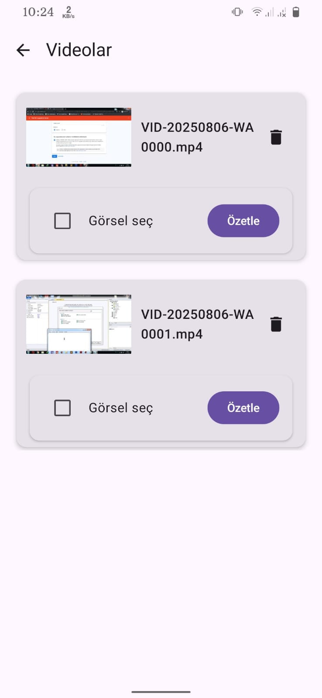
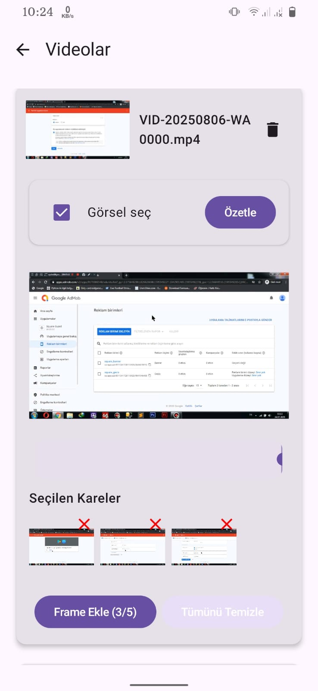
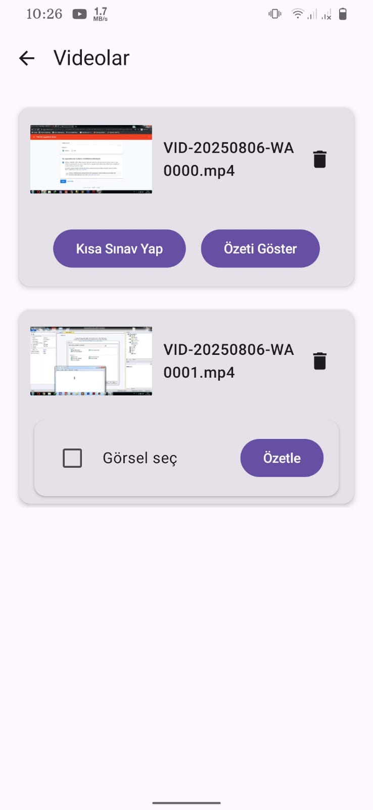
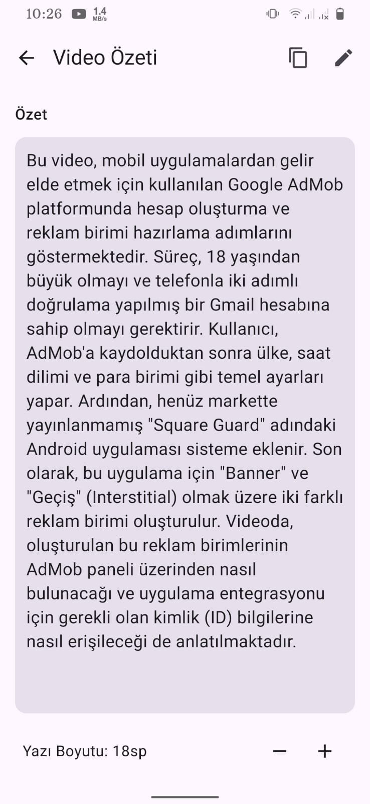
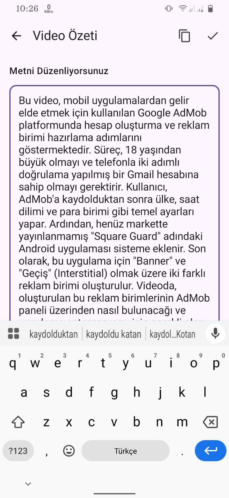
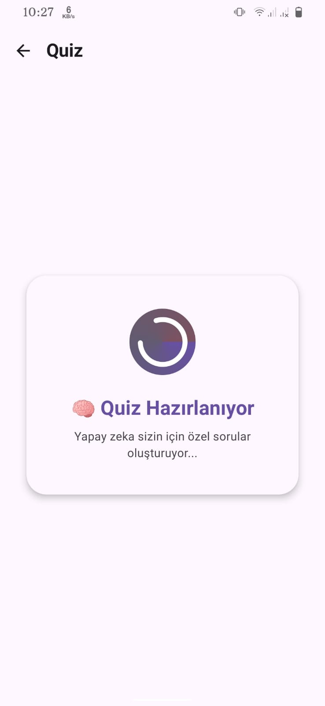
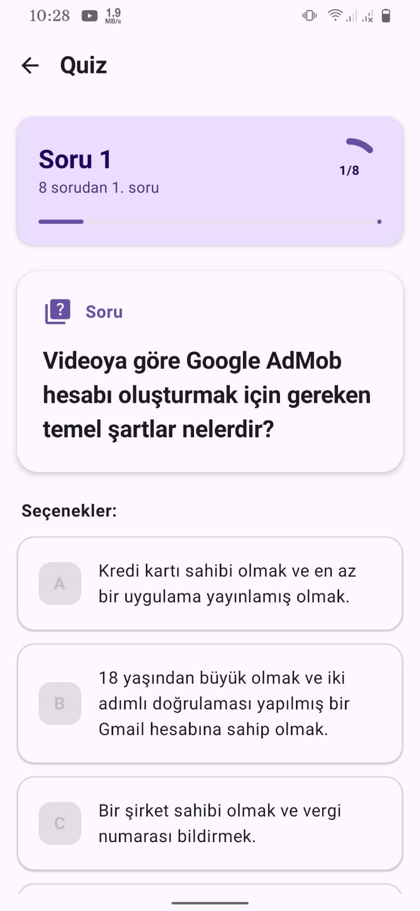
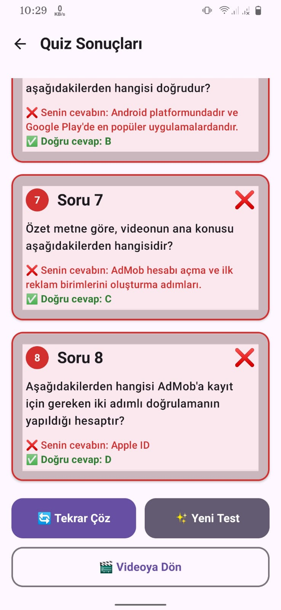

# 🎬 Last Minute Genius — AI-Powered Video Summarizer & Quiz Generator

**Last Minute Genius** is an Android app that helps students, educators, and curious minds understand video content faster through AI-generated summaries and interactive quizzes. With a smart blend of audio transcription, visual frame analysis, and Gemini AI, you can turn any educational video into meaningful study material in minutes.

---

## 📲 Download & Try It

- 📱 **[Download APK](https://drive.google.com/file/d/1sgewP1MF868QcCsFDlRYOlP-B-8qcKH2/view?usp=sharing)**
- 🧬 **Clone the Repository:**

```bash
git clone https://github.com/ZaferGuvenn/LastMinuteGenius.git
✨ Features
🎥 Video to Audio: Converts videos to .flac format using FFmpeg.

🔊 Cloud-Based Audio Processing: Uploads the audio securely to Firebase Storage.

🖼️ Visual Enhancement: Select up to 5 key frames to enrich the AI’s context understanding.

🧠 AI Summarization: Combines Google STT + Gemini API to produce natural, readable summaries.

📝 Editable Summaries: Modify summaries directly inside the app.

❓ Quiz Generator: Instantly create multiple-choice questions from any summary.

💾 Local Storage: Save everything offline using Room DB.

🔐 Anonymous Firebase Auth: No login needed to use core features.

🧱 Modern Stack: Jetpack Compose, Retrofit, Room, FastAPI (Cloud Run), and Firebase.

## 🖼️ Screenshots

### 1. Summary Screen  


### 2. Frame Selection  


### 3. Frame Preview  


### 4. Upload in Progress  


### 5. Audio Transcription & Gemini  


### 6. Editable Summary  


### 7. Quiz Question Preview  


### 8. Final Summary & Test Result  



📹 Demo Video
Watch the full walkthrough here: https://www.youtube.com/watch?v=a6wiAR-3vsM
📺 YouTube Demo

🚀 How It Works
Select a Video from your gallery.

The app extracts audio via FFmpeg and uploads it to Firebase Storage anonymously.

You can optionally select 1–5 video frames to improve summary quality.

Backend on Cloud Run (FastAPI) fetches the audio from the Firebase link and transcribes it using Google STT.

Transcribed text + selected images are sent to Gemini AI for summarization.

View, edit, and save the summary.

Generate a quiz based on the summary to test yourself before an exam.

👥 Ideal For
🧑‍🎓 Students cramming before exams

👩‍🏫 Educators creating quick revision material

📊 Researchers analyzing lecture or tutorial videos

🧠 Anyone wanting to save time while studying visual content

👮 Legal & User Responsibility
⚠️ Important Notice
All uploaded media (audio and image frames) are temporarily stored and processed via Firebase and Google Cloud services.

By using this app, the user agrees that:

They own or have legal rights to use and process the selected video content.

They take full responsibility for any content uploaded to cloud services.

Summaries and questions are for personal/educational use only.

The developer holds no liability for copyright issues, misuse of the content, or third-party data processing.

🧪 Tech Stack
Layer	Technology
UI	Jetpack Compose
Local DB	Room
Network	Retrofit
Auth	Firebase Anonymous Auth
Storage	Firebase Storage
Audio	FFmpeg (on-device)
Backend	FastAPI on Google Cloud Run
Transcribe	Google Speech-to-Text API
Summarize	Gemini AI (Google Generative AI)

🤝 Contributing
Coming soon...

📩 Support
For issues, feature requests, or feedback:
👉 Open an issue on GitHub

📜 License
pgsql
Düzenle
MIT License

This project is intended for educational and personal use only.
By uploading media, you confirm you own or are authorized to use such content.
The developer assumes no liability for any misuse or legal issues arising from user-submitted content.
Made with ❤️ by Zafer Güven
